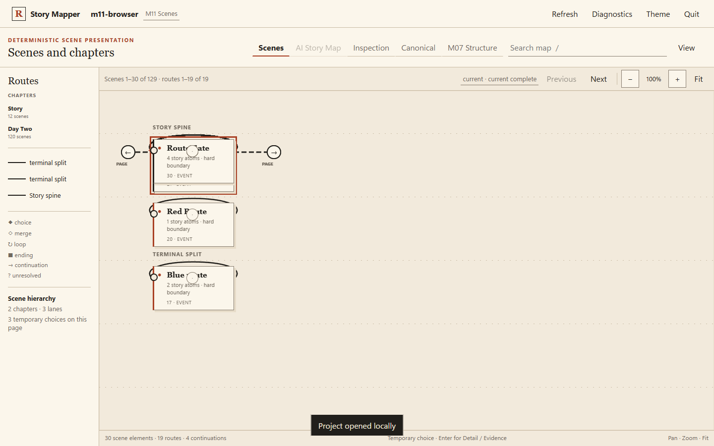
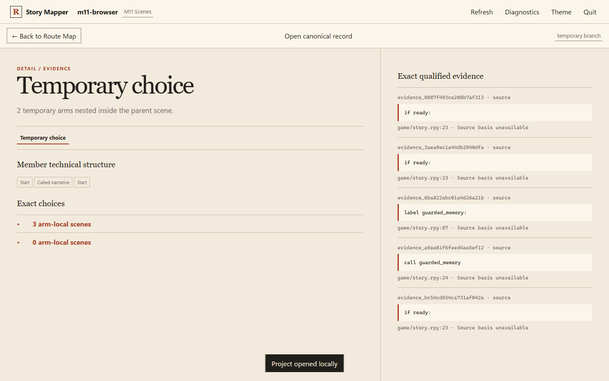
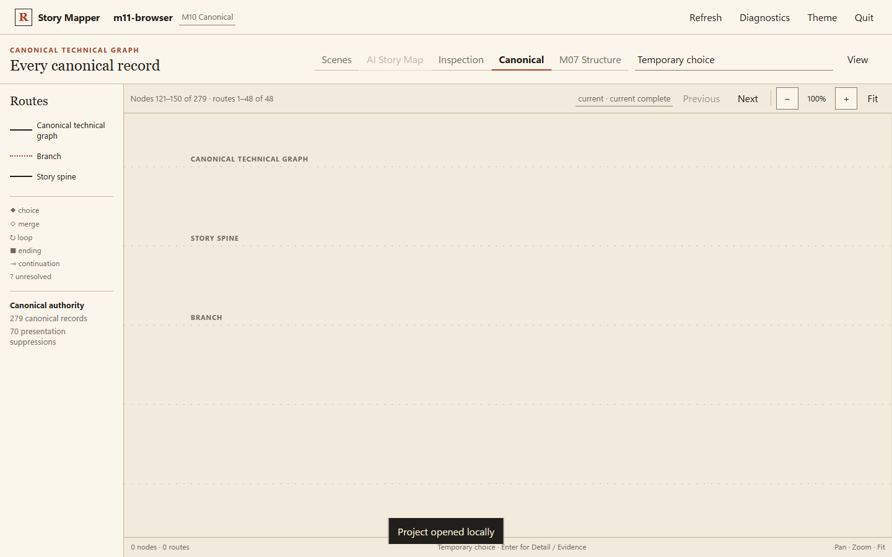
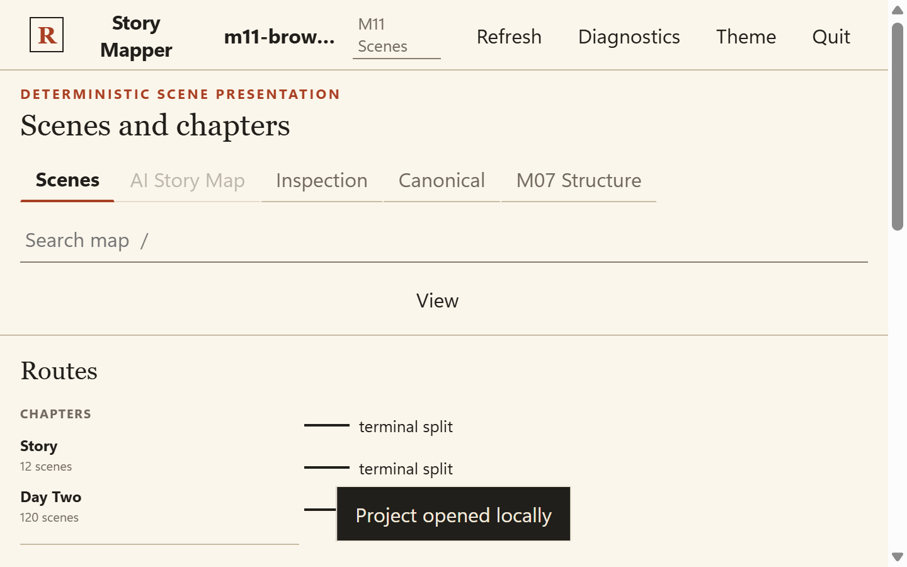
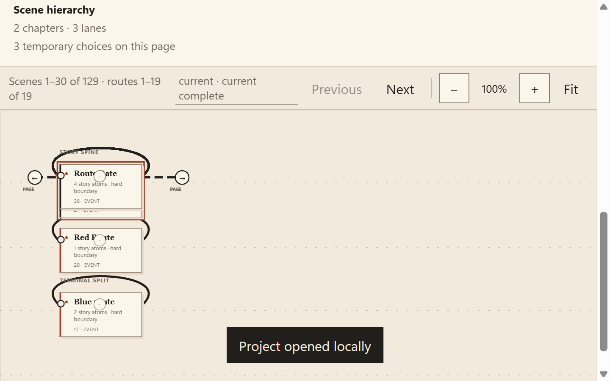
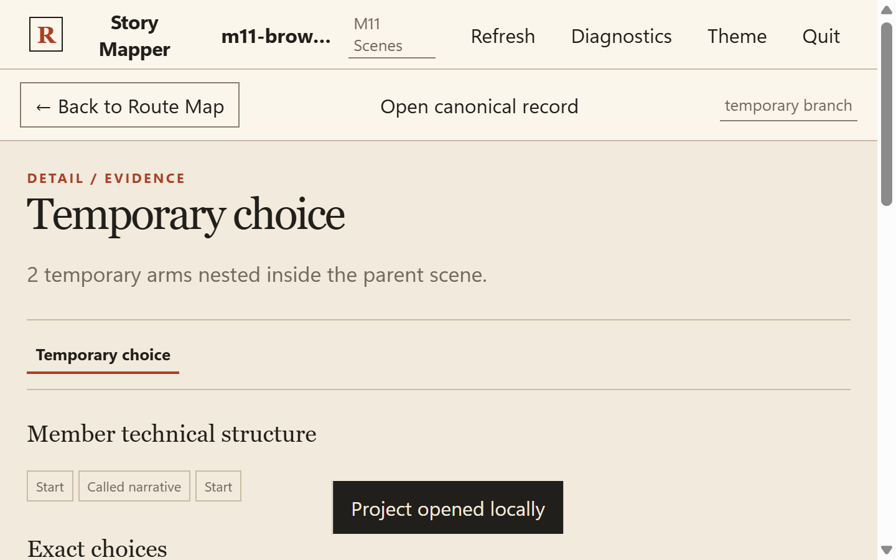
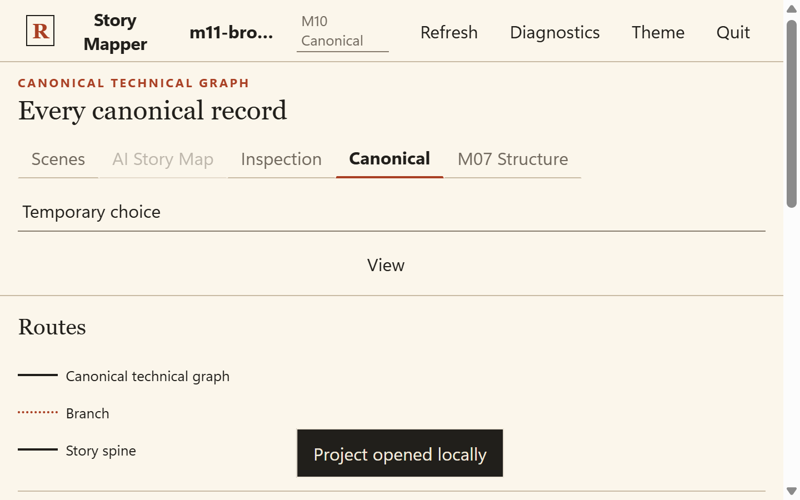

# M11 scene-quality review evidence

This report is a review-only diagnostic generated from the accepted private M11 result. It contains structural identifiers, relative source locators, and generic atom-kind descriptions only. It contains no commercial dialogue, commercial source text, or commercial images/assets.

## Scene atom-count distribution

| Measure | Value |
| --- | ---: |
| Scenes | 4076 |
| Singleton scenes | 337 (8.268%) |
| Median atoms | 2.0 |
| p75 atoms | 2 |
| p90 atoms | 3 |
| p99 atoms | 5 |
| Maximum atoms | 17 |

Percentiles: nearest-rank for p75/p90/p99; conventional median.

## Accepted boundaries

Accepted total: **3791**.

| Strength | Accepted |
| --- | ---: |
| hard | 3784 |
| strong | 7 |
| weak | 0 |
| conflict | 0 |

| Strength | Rule | Count | Deterministic reason |
| --- | --- | ---: | --- |
| hard | `canonical_module_boundary` | 28 | M10 module ownership prevents disconnected source files from sharing a scene. |
| hard | `canonical_procedure_entry` | 145 | M10 procedure ownership prevents unrelated source definitions from sharing a scene. |
| hard | `corpus_start` | 1 | The first canonical atom starts the deterministic scene draft. |
| hard | `explicit_scene_reset` | 3598 | A source-authored scene statement supplies a hard visual reset. |
| hard | `persistent_lane_entry` | 12 | M10 classifies this atom as a persistent or terminal route-arm entry. |
| strong | `visual_context_change` | 7 | A source-authored visual context change supports a strong scene boundary. |

## Representative Day 1 choice and rejoin scenes

The 18 records below cover the four independently reviewed choice/rejoin anchors. Descriptions are intentionally structural rather than narrative.

| Scene | Lane / chapter | Atoms | First -> last locator | Boundary | Temporary membership | Choice context | Description |
| --- | --- | ---: | --- | --- | --- | --- | --- |
| `scene_227a60f8472af75f8ed3` | `lane_story_spine` (spine) / `chapter_story` | 6 | `game/v0.01_clean.rpy:137:5` -> `game/v0.01_clean.rpy:143:5` | hard / `explicit_scene_reset`: A source-authored scene statement supplies a hard visual reset. | `branch_5061d629946e44848ae9` parent_scene | choice 1 choice_parent | Generic structural description: atom kinds [choice=1, narration=3, technical=1, visual_change=1]; source kinds [menu=1, merge=1, scene=1, statement=3]; story-facing=5; supporting=1. |
| `scene_ba9bb807b757507c3935` | `lane_story_spine` (spine) / `chapter_story` | 1 | `game/v0.01_clean.rpy:144:9` -> `game/v0.01_clean.rpy:144:9` | none; stored start candidate rejected weak / `continuation_candidate` | `branch_5061d629946e44848ae9` arm_local_scene arm 0 | choice 1 arm_0_entry | Generic structural description: atom kinds [choice=1]; source kinds [menu_choice=1]; story-facing=1; supporting=0. |
| `scene_819987374ff8a344657f` | `lane_story_spine` (spine) / `chapter_story` | 2 | `game/v0.01_clean.rpy:155:9` -> `game/v0.01_clean.rpy:157:13` | none; stored start candidate rejected weak / `continuation_candidate` | `branch_5061d629946e44848ae9` arm_local_scene arm 1 | choice 1 arm_1_entry | Generic structural description: atom kinds [choice=1, technical=1]; source kinds [menu_choice=1, merge=1]; story-facing=1; supporting=1. |
| `scene_9d5010720a587b4e5cb3` | `lane_story_spine` (spine) / `chapter_story` | 3 | `game/v0.01_clean.rpy:152:13` -> `game/v0.01_clean.rpy:154:13` | hard / `explicit_scene_reset`: A source-authored scene statement supplies a hard visual reset. | `branch_5061d629946e44848ae9` arm_local_scene arm 0 | choice 1 longest_arm_tail | Generic structural description: atom kinds [narration=2, visual_change=1]; source kinds [scene=1, statement=2]; story-facing=3; supporting=0. |
| `scene_1e4ff54905c0a98552fc` | `lane_story_spine` (spine) / `chapter_story` | 2 | `game/v0.01_clean.rpy:165:5` -> `game/v0.01_clean.rpy:166:5` | hard / `explicit_scene_reset`: A source-authored scene statement supplies a hard visual reset. | none | choice 1 exact_rejoin | Generic structural description: atom kinds [narration=1, visual_change=1]; source kinds [scene=1, statement=1]; story-facing=2; supporting=0. |
| `scene_23dab604272657c60e5a` | `lane_story_spine` (spine) / `chapter_story` | 4 | `game/v0.01_clean.rpy:188:5` -> `game/v0.01_clean.rpy:191:5` | hard / `explicit_scene_reset`: A source-authored scene statement supplies a hard visual reset. | `branch_03303e1727595c14565c` parent_scene | choice 2 choice_parent | Generic structural description: atom kinds [choice=1, narration=1, technical=1, visual_change=1]; source kinds [menu=1, merge=1, scene=1, statement=1]; story-facing=3; supporting=1. |
| `scene_eb3b713c74b5eef353c3` | `lane_story_spine` (spine) / `chapter_story` | 2 | `game/v0.01_clean.rpy:192:9` -> `game/v0.01_clean.rpy:193:13` | none; stored start candidate rejected weak / `continuation_candidate` | `branch_03303e1727595c14565c` arm_local_scene arm 0 | choice 2 arm_0_entry | Generic structural description: atom kinds [choice=1, state_change=1]; source kinds [menu_choice=1, opaque=1]; story-facing=1; supporting=1. |
| `scene_5f0c59a4c5be841bcfb4` | `lane_story_spine` (spine) / `chapter_story` | 1 | `game/v0.01_clean.rpy:224:9` -> `game/v0.01_clean.rpy:224:9` | none; stored start candidate rejected weak / `continuation_candidate` | `branch_03303e1727595c14565c` arm_local_scene arm 1 | choice 2 arm_1_entry | Generic structural description: atom kinds [choice=1]; source kinds [menu_choice=1]; story-facing=1; supporting=0. |
| `scene_8800bc3f9b6e08db16fd` | `lane_story_spine` (spine) / `chapter_story` | 2 | `game/v0.01_clean.rpy:222:13` -> `game/v0.01_clean.rpy:223:13` | hard / `explicit_scene_reset`: A source-authored scene statement supplies a hard visual reset. | `branch_03303e1727595c14565c` arm_local_scene arm 0 | choice 2 longest_arm_tail | Generic structural description: atom kinds [narration=1, visual_change=1]; source kinds [scene=1, statement=1]; story-facing=2; supporting=0. |
| `scene_010042c4ae075a2b4d17` | `lane_story_spine` (spine) / `chapter_story` | 3 | `game/v0.01_clean.rpy:233:5` -> `game/v0.01_clean.rpy:235:5` | hard / `explicit_scene_reset`: A source-authored scene statement supplies a hard visual reset. | none | choice 2 exact_rejoin | Generic structural description: atom kinds [narration=2, visual_change=1]; source kinds [scene=1, statement=2]; story-facing=3; supporting=0. |
| `scene_c05783e78640ed3742e2` | `lane_story_spine` (spine) / `chapter_story` | 4 | `game/v0.01_clean.rpy:620:5` -> `game/v0.01_clean.rpy:623:5` | hard / `explicit_scene_reset`: A source-authored scene statement supplies a hard visual reset. | `branch_7f9b5a0923dbad0d2355` parent_scene | choice 3 choice_parent | Generic structural description: atom kinds [choice=1, narration=1, technical=1, visual_change=1]; source kinds [menu=1, merge=1, scene=1, statement=1]; story-facing=3; supporting=1. |
| `scene_ea734f93ddd910866194` | `lane_story_spine` (spine) / `chapter_story` | 2 | `game/v0.01_clean.rpy:624:9` -> `game/v0.01_clean.rpy:625:13` | none; stored start candidate rejected weak / `continuation_candidate` | `branch_7f9b5a0923dbad0d2355` arm_local_scene arm 0 | choice 3 arm_0_entry | Generic structural description: atom kinds [choice=1, state_change=1]; source kinds [menu_choice=1, opaque=1]; story-facing=1; supporting=1. |
| `scene_6e7d2710cf47ca9c4250` | `lane_story_spine` (spine) / `chapter_story` | 4 | `game/v0.01_clean.rpy:628:9` -> `game/v0.01_clean.rpy:631:13` | none; stored start candidate rejected weak / `continuation_candidate` | `branch_7f9b5a0923dbad0d2355` arm_local_scene arm 1; `branch_849fbc9b0c7dba46171d` parent_scene | choice 3 arm_1_entry | Generic structural description: atom kinds [choice=1, condition=1, state_change=1, technical=1]; source kinds [if=1, menu_choice=1, merge=1, opaque=1]; story-facing=1; supporting=3. |
| `scene_4383f1cc3c22a5eac230` | `lane_story_spine` (spine) / `chapter_story` | 4 | `game/v0.01_clean.rpy:671:13` -> `game/v0.01_clean.rpy:674:13` | hard / `explicit_scene_reset`: A source-authored scene statement supplies a hard visual reset. | `branch_7f9b5a0923dbad0d2355` arm_local_scene arm 1; `branch_8d07ba556d38a09de595` parent_scene | choice 3 longest_arm_tail; choice 4 choice_parent | Generic structural description: atom kinds [choice=1, narration=1, technical=1, visual_change=1]; source kinds [menu=1, merge=1, scene=1, statement=1]; story-facing=3; supporting=1. |
| `scene_48c3c508bf6a8a5f37a4` | `lane_story_spine` (spine) / `chapter_story` | 2 | `game/v0.01_clean.rpy:793:5` -> `game/v0.01_clean.rpy:794:5` | hard / `explicit_scene_reset`: A source-authored scene statement supplies a hard visual reset. | none | choice 3 exact_rejoin; choice 4 exact_rejoin | Generic structural description: atom kinds [narration=1, visual_change=1]; source kinds [pause=1, scene=1]; story-facing=2; supporting=0. |
| `scene_b6188df9fbf3eea658fb` | `lane_story_spine` (spine) / `chapter_story` | 1 | `game/v0.01_clean.rpy:675:17` -> `game/v0.01_clean.rpy:675:17` | none; stored start candidate rejected weak / `continuation_candidate` | `branch_8d07ba556d38a09de595` arm_local_scene arm 0 | choice 4 arm_0_entry | Generic structural description: atom kinds [choice=1]; source kinds [menu_choice=1]; story-facing=1; supporting=0. |
| `scene_4373d8826b66f7be1ab0` | `lane_story_spine` (spine) / `chapter_story` | 2 | `game/v0.01_clean.rpy:705:17` -> `game/v0.01_clean.rpy:707:21` | none; stored start candidate rejected weak / `continuation_candidate` | `branch_8d07ba556d38a09de595` arm_local_scene arm 1; `branch_d71982dc3199c9f0f964` parent_scene | choice 4 arm_1_entry | Generic structural description: atom kinds [choice=1, condition=1]; source kinds [if=1, menu_choice=1]; story-facing=1; supporting=1. |
| `scene_0f8a32c8907af41b8842` | `lane_story_spine` (spine) / `chapter_story` | 2 | `game/v0.01_clean.rpy:788:21` -> `game/v0.01_clean.rpy:789:21` | hard / `explicit_scene_reset`: A source-authored scene statement supplies a hard visual reset. | `branch_8d07ba556d38a09de595` arm_local_scene arm 1 | choice 4 longest_arm_tail | Generic structural description: atom kinds [narration=1, visual_change=1]; source kinds [pause=1, scene=1]; story-facing=2; supporting=0. |

## Synthetic browser evidence

These captures use only `tests/fixtures/m11/human_scenes.rpy` plus generated synthetic appendix labels. The scene overview shows the common spine and the persistent-lane presentation for the M10-classified terminal split; the detail view shows a temporary multi-scene branch and deterministic provenance; the canonical escape shows the direct M10 authority path.

| Review requirement | 100% evidence | 200% evidence |
| --- | --- | --- |
| Common spine and separate persistent/terminal lanes | `m11-scenes-100.png` | `m11-scenes-cards-200.png` |
| Temporary multi-scene branch | `m11-scene-detail-100.png` | `m11-scene-detail-200.png` |
| Scene-detail provenance and M10 escape | `m11-scene-detail-100.png`, `m11-canonical-escape-100.png` | `m11-scene-detail-200.png`, `m11-canonical-escape-200.png` |

### 100%

### 200%

