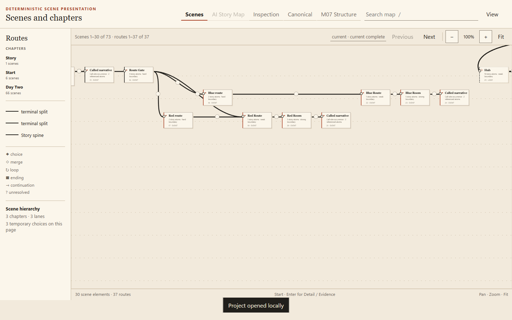

# M11 scene-quality review evidence

This report is a review-only diagnostic generated from the accepted private M11 result. It contains structural identifiers, relative source locators, and generic atom-kind descriptions only. It contains no commercial dialogue, commercial source text, or commercial images/assets.

## Scene atom-count distribution

| Measure | Value |
| --- | ---: |
| Scenes | 1812 |
| Singleton scenes | 276 (15.232%) |
| Median atoms | 6.0 |
| p75 atoms | 6 |
| p90 atoms | 7 |
| p99 atoms | 10 |
| Maximum atoms | 25 |

Percentiles: nearest-rank for p75/p90/p99; conventional median.

## Before/after bounded correction

| Scene distribution | Before | After |
| --- | ---: | ---: |
| Scenes | 4076 | 1812 |
| Singleton scenes | 337 (8.268%) | 276 (15.232%) |
| Median | 2.0 | 6.0 |
| p75 | 2 | 6 |
| p90 | 3 | 7 |
| p99 | 5 | 10 |
| Maximum | 17 | 25 |

| Accepted boundary rule | Before | After |
| --- | ---: | ---: |
| `canonical_module_boundary` | 28 | 28 |
| `canonical_procedure_entry` | 145 | 86 |
| `corpus_start` | 1 | 1 |
| `explicit_scene_reset` | 3598 | 0 |
| `minimum_narrative_run` | 0 | 1328 |
| `persistent_lane_entry` | 12 | 12 |
| `reinforced_resolved_transfer` | 0 | 7 |
| `terminal_transition` | 0 | 34 |
| `unresolved_safety` | 0 | 131 |
| `visual_context_change` | 7 | 0 |

## Accepted boundaries

Accepted total: **1627**.

| Strength | Accepted |
| --- | ---: |
| hard | 292 |
| strong | 1335 |
| weak | 0 |
| conflict | 0 |

| Strength | Rule | Count | Deterministic reason |
| --- | --- | ---: | --- |
| hard | `canonical_module_boundary` | 28 | M10 module ownership prevents disconnected source files from sharing a scene. |
| hard | `canonical_procedure_entry` | 86 | M10 has no normal resolved story predecessor for this procedure entry. |
| hard | `corpus_start` | 1 | The first canonical atom starts the deterministic scene draft. |
| hard | `persistent_lane_entry` | 12 | M10 classifies this atom as a persistent or terminal route-arm entry. |
| hard | `terminal_transition` | 34 | The atom after an M10 terminal begins separate presentation ownership. |
| hard | `unresolved_safety` | 131 | M10 marks this story transition unresolved, so presentation cannot merge across it. |
| strong | `minimum_narrative_run` | 1328 | A source-authored scene reset follows the versioned minimum narrative run of 3 atoms. |
| strong | `reinforced_resolved_transfer` | 7 | An exact resolved M10 story transfer reinforces this source-authored scene reset. |

## Representative Day 1 choice and rejoin scene sequences

The 19 sequence records below cover the four independently reviewed choice/rejoin anchors. Each record includes bounded ordered paths through the exact temporary arm and rejoin; descriptions are structural rather than narrative.

| Scene | Lane / chapter | Atoms | First -> last locator | Boundary | Temporary membership | Ordered structural path(s) | Choice context | Description |
| --- | --- | ---: | --- | --- | --- | --- | --- | --- |
| `scene_dcfb30c09cf04f884858` | `lane_story_spine` (spine) / `chapter_story` | 9 | `game/v0.01_clean.rpy:133:5` -> `game/v0.01_clean.rpy:143:5` | strong / `minimum_narrative_run`: A source-authored scene reset follows the versioned minimum narrative run of 3 atoms. | `branch_5061d629946e44848ae9` parent_scene | choice 1 arm 0: **`scene_dcfb30c09cf04f884858`** -> `scene_838edf571a11d323a419` -> `scene_eae49c21db14d9e2eb69` -> `scene_906fcfc4a545283cf381` choice 1 arm 1: **`scene_dcfb30c09cf04f884858`** -> `scene_3aab1f28165e7bd783a8` -> `scene_d06f0be183c03989f7e5` -> `scene_f6e9283006539b6b6cd8` -> `scene_906fcfc4a545283cf381` | choice 1 choice_parent | Generic structural description: atom kinds [choice=1, narration=5, visual_change=3]; source kinds [menu=1, scene=3, statement=5]; story-facing=9; supporting=0. |
| `scene_838edf571a11d323a419` | `lane_story_spine` (spine) / `chapter_story` | 6 | `game/v0.01_clean.rpy:144:9` -> `game/v0.01_clean.rpy:149:13` | none; stored start candidate rejected weak / `continuation_candidate` | `branch_5061d629946e44848ae9` arm_local_scene arm 0 | choice 1 arm 0: `scene_dcfb30c09cf04f884858` -> **`scene_838edf571a11d323a419`** -> `scene_eae49c21db14d9e2eb69` -> `scene_906fcfc4a545283cf381` | choice 1 arm_0_entry | Generic structural description: atom kinds [choice=1, narration=3, visual_change=2]; source kinds [menu_choice=1, scene=2, statement=3]; story-facing=6; supporting=0. |
| `scene_3aab1f28165e7bd783a8` | `lane_story_spine` (spine) / `chapter_story` | 1 | `game/v0.01_clean.rpy:155:9` -> `game/v0.01_clean.rpy:155:9` | none; stored start candidate rejected weak / `continuation_candidate` | `branch_5061d629946e44848ae9` arm_local_scene arm 1 | choice 1 arm 1: `scene_dcfb30c09cf04f884858` -> **`scene_3aab1f28165e7bd783a8`** -> `scene_d06f0be183c03989f7e5` -> `scene_f6e9283006539b6b6cd8` -> `scene_906fcfc4a545283cf381` | choice 1 arm_1_entry | Generic structural description: atom kinds [choice=1]; source kinds [menu_choice=1]; story-facing=1; supporting=0. |
| `scene_f6e9283006539b6b6cd8` | `lane_story_spine` (spine) / `chapter_story` | 6 | `game/v0.01_clean.rpy:157:13` -> `game/v0.01_clean.rpy:163:13` | hard / `unresolved_safety`: M10 marks this story transition unresolved, so presentation cannot merge across it. | `branch_5061d629946e44848ae9` arm_local_scene arm 1 | choice 1 arm 1: `scene_dcfb30c09cf04f884858` -> `scene_3aab1f28165e7bd783a8` -> `scene_d06f0be183c03989f7e5` -> **`scene_f6e9283006539b6b6cd8`** -> `scene_906fcfc4a545283cf381` | choice 1 longest_arm_tail | Generic structural description: atom kinds [narration=2, state_change=2, technical=1, visual_change=1]; source kinds [merge=1, opaque=2, scene=1, statement=2]; story-facing=3; supporting=3. |
| `scene_906fcfc4a545283cf381` | `lane_story_spine` (spine) / `chapter_story` | 6 | `game/v0.01_clean.rpy:165:5` -> `game/v0.01_clean.rpy:170:5` | strong / `minimum_narrative_run`: A source-authored scene reset follows the versioned minimum narrative run of 3 atoms. | none | choice 1 arm 0: `scene_dcfb30c09cf04f884858` -> `scene_838edf571a11d323a419` -> `scene_eae49c21db14d9e2eb69` -> **`scene_906fcfc4a545283cf381`** choice 1 arm 1: `scene_dcfb30c09cf04f884858` -> `scene_3aab1f28165e7bd783a8` -> `scene_d06f0be183c03989f7e5` -> `scene_f6e9283006539b6b6cd8` -> **`scene_906fcfc4a545283cf381`** | choice 1 exact_rejoin | Generic structural description: atom kinds [narration=3, visual_change=3]; source kinds [scene=3, statement=3]; story-facing=6; supporting=0. |
| `scene_c9f4c898329c0f957575` | `lane_story_spine` (spine) / `chapter_story` | 3 | `game/v0.01_clean.rpy:188:5` -> `game/v0.01_clean.rpy:191:5` | strong / `minimum_narrative_run`: A source-authored scene reset follows the versioned minimum narrative run of 3 atoms. | `branch_03303e1727595c14565c` parent_scene | choice 2 arm 0: **`scene_c9f4c898329c0f957575`** -> `scene_eb3b713c74b5eef353c3` -> `scene_f7e3081358aff229e4f7` (5 intermediate scene(s) omitted) choice 2 arm 1: **`scene_c9f4c898329c0f957575`** -> `scene_65fb4bb3e20e1a06bdf9` -> `scene_f7e3081358aff229e4f7` | choice 2 choice_parent | Generic structural description: atom kinds [choice=1, narration=1, visual_change=1]; source kinds [menu=1, scene=1, statement=1]; story-facing=3; supporting=0. |
| `scene_eb3b713c74b5eef353c3` | `lane_story_spine` (spine) / `chapter_story` | 2 | `game/v0.01_clean.rpy:192:9` -> `game/v0.01_clean.rpy:193:13` | none; stored start candidate rejected weak / `continuation_candidate` | `branch_03303e1727595c14565c` arm_local_scene arm 0 | choice 2 arm 0: `scene_c9f4c898329c0f957575` -> **`scene_eb3b713c74b5eef353c3`** -> `scene_b6a2fee541cd462adb29` -> `scene_f7e3081358aff229e4f7` (4 intermediate scene(s) omitted) | choice 2 arm_0_entry | Generic structural description: atom kinds [choice=1, state_change=1]; source kinds [menu_choice=1, opaque=1]; story-facing=1; supporting=1. |
| `scene_65fb4bb3e20e1a06bdf9` | `lane_story_spine` (spine) / `chapter_story` | 4 | `game/v0.01_clean.rpy:224:9` -> `game/v0.01_clean.rpy:230:13` | none; stored start candidate rejected weak / `continuation_candidate` | `branch_03303e1727595c14565c` arm_local_scene arm 1 | choice 2 arm 1: `scene_c9f4c898329c0f957575` -> **`scene_65fb4bb3e20e1a06bdf9`** -> `scene_f7e3081358aff229e4f7` | choice 2 arm_1_entry | Generic structural description: atom kinds [choice=1, narration=2, visual_change=1]; source kinds [menu_choice=1, scene=1, statement=2]; story-facing=4; supporting=0. |
| `scene_adb9425915418ff37a71` | `lane_story_spine` (spine) / `chapter_story` | 6 | `game/v0.01_clean.rpy:218:13` -> `game/v0.01_clean.rpy:223:13` | strong / `minimum_narrative_run`: A source-authored scene reset follows the versioned minimum narrative run of 3 atoms. | `branch_03303e1727595c14565c` arm_local_scene arm 0 | choice 2 arm 0: `scene_c9f4c898329c0f957575` -> `scene_9f1fd802db2f178b8c22` -> **`scene_adb9425915418ff37a71`** -> `scene_f7e3081358aff229e4f7` (4 intermediate scene(s) omitted) | choice 2 longest_arm_tail | Generic structural description: atom kinds [narration=3, visual_change=3]; source kinds [scene=3, statement=3]; story-facing=6; supporting=0. |
| `scene_f7e3081358aff229e4f7` | `lane_story_spine` (spine) / `chapter_story` | 4 | `game/v0.01_clean.rpy:191:5` -> `game/v0.01_clean.rpy:235:5` | none; stored start candidate rejected weak / `continuation_candidate` | none | choice 2 arm 0: `scene_c9f4c898329c0f957575` -> `scene_adb9425915418ff37a71` -> **`scene_f7e3081358aff229e4f7`** (5 intermediate scene(s) omitted) choice 2 arm 1: `scene_c9f4c898329c0f957575` -> `scene_65fb4bb3e20e1a06bdf9` -> **`scene_f7e3081358aff229e4f7`** | choice 2 exact_rejoin | Generic structural description: atom kinds [narration=2, technical=1, visual_change=1]; source kinds [merge=1, scene=1, statement=2]; story-facing=3; supporting=1. |
| `scene_962aef1d2d705317f1c7` | `lane_story_spine` (spine) / `chapter_story` | 3 | `game/v0.01_clean.rpy:620:5` -> `game/v0.01_clean.rpy:623:5` | strong / `minimum_narrative_run`: A source-authored scene reset follows the versioned minimum narrative run of 3 atoms. | `branch_7f9b5a0923dbad0d2355` parent_scene | choice 3 arm 0: **`scene_962aef1d2d705317f1c7`** -> `scene_2da65da0a248e412876c` -> `scene_c401563ff030a434fb6e` choice 3 arm 1: **`scene_962aef1d2d705317f1c7`** -> `scene_24cd2fdcdfb5c262d41c` -> `scene_c401563ff030a434fb6e` (9 intermediate scene(s) omitted) | choice 3 choice_parent | Generic structural description: atom kinds [choice=1, narration=1, visual_change=1]; source kinds [menu=1, scene=1, statement=1]; story-facing=3; supporting=0. |
| `scene_2da65da0a248e412876c` | `lane_story_spine` (spine) / `chapter_story` | 4 | `game/v0.01_clean.rpy:624:9` -> `game/v0.01_clean.rpy:627:13` | none; stored start candidate rejected weak / `continuation_candidate` | `branch_7f9b5a0923dbad0d2355` arm_local_scene arm 0 | choice 3 arm 0: `scene_962aef1d2d705317f1c7` -> **`scene_2da65da0a248e412876c`** -> `scene_c401563ff030a434fb6e` | choice 3 arm_0_entry | Generic structural description: atom kinds [choice=1, narration=1, state_change=1, visual_change=1]; source kinds [menu_choice=1, opaque=1, scene=1, statement=1]; story-facing=3; supporting=1. |
| `scene_24cd2fdcdfb5c262d41c` | `lane_story_spine` (spine) / `chapter_story` | 2 | `game/v0.01_clean.rpy:628:9` -> `game/v0.01_clean.rpy:630:13` | none; stored start candidate rejected weak / `continuation_candidate` | `branch_7f9b5a0923dbad0d2355` arm_local_scene arm 1 | choice 3 arm 1: `scene_962aef1d2d705317f1c7` -> **`scene_24cd2fdcdfb5c262d41c`** -> `scene_72c73a4f15cfa950e7e0` -> `scene_c401563ff030a434fb6e` (8 intermediate scene(s) omitted) | choice 3 arm_1_entry | Generic structural description: atom kinds [choice=1, state_change=1]; source kinds [menu_choice=1, opaque=1]; story-facing=1; supporting=1. |
| `scene_78e43be6a7673a06f51f` | `lane_story_spine` (spine) / `chapter_story` | 1 | `game/v0.01_clean.rpy:674:13` -> `game/v0.01_clean.rpy:674:13` | none; stored start candidate rejected weak / `continuation_candidate` | `branch_7f9b5a0923dbad0d2355` arm_local_scene arm 1 | choice 3 arm 1: `scene_962aef1d2d705317f1c7` -> `scene_b346a2d6fbb7748d26e3` -> **`scene_78e43be6a7673a06f51f`** -> `scene_c401563ff030a434fb6e` (8 intermediate scene(s) omitted) | choice 3 longest_arm_tail | Generic structural description: atom kinds [technical=1]; source kinds [merge=1]; story-facing=0; supporting=1. |
| `scene_c401563ff030a434fb6e` | `lane_story_spine` (spine) / `chapter_story` | 5 | `game/v0.01_clean.rpy:623:5` -> `game/v0.01_clean.rpy:796:5` | none; stored start candidate rejected weak / `continuation_candidate` | none | choice 3 arm 0: `scene_962aef1d2d705317f1c7` -> `scene_2da65da0a248e412876c` -> **`scene_c401563ff030a434fb6e`** choice 3 arm 1: `scene_962aef1d2d705317f1c7` -> `scene_78e43be6a7673a06f51f` -> **`scene_c401563ff030a434fb6e`** (9 intermediate scene(s) omitted) choice 4 arm 0: `scene_b346a2d6fbb7748d26e3` -> `scene_fc2e24bab1bf6f80c7dd` -> **`scene_c401563ff030a434fb6e`** (4 intermediate scene(s) omitted) choice 4 arm 1: `scene_b346a2d6fbb7748d26e3` -> `scene_a57db7a647d5d8e9a538` -> **`scene_c401563ff030a434fb6e`** (14 intermediate scene(s) omitted) | choice 3 exact_rejoin; choice 4 exact_rejoin | Generic structural description: atom kinds [narration=2, technical=1, visual_change=2]; source kinds [merge=1, pause=2, scene=2]; story-facing=4; supporting=1. |
| `scene_b346a2d6fbb7748d26e3` | `lane_story_spine` (spine) / `chapter_story` | 3 | `game/v0.01_clean.rpy:671:13` -> `game/v0.01_clean.rpy:674:13` | strong / `minimum_narrative_run`: A source-authored scene reset follows the versioned minimum narrative run of 3 atoms. | `branch_7f9b5a0923dbad0d2355` arm_local_scene arm 1; `branch_8d07ba556d38a09de595` parent_scene | choice 4 arm 0: **`scene_b346a2d6fbb7748d26e3`** -> `scene_cbc5e4b129902558d1e6` -> `scene_c401563ff030a434fb6e` (4 intermediate scene(s) omitted) choice 4 arm 1: **`scene_b346a2d6fbb7748d26e3`** -> `scene_31969043e5da158e6ab3` -> `scene_c401563ff030a434fb6e` (14 intermediate scene(s) omitted) | choice 4 choice_parent | Generic structural description: atom kinds [choice=1, narration=1, visual_change=1]; source kinds [menu=1, scene=1, statement=1]; story-facing=3; supporting=0. |
| `scene_cbc5e4b129902558d1e6` | `lane_story_spine` (spine) / `chapter_story` | 6 | `game/v0.01_clean.rpy:675:17` -> `game/v0.01_clean.rpy:680:21` | none; stored start candidate rejected weak / `continuation_candidate` | `branch_8d07ba556d38a09de595` arm_local_scene arm 0 | choice 4 arm 0: `scene_b346a2d6fbb7748d26e3` -> **`scene_cbc5e4b129902558d1e6`** -> `scene_3dfadb04d0217fe70b33` -> `scene_c401563ff030a434fb6e` (3 intermediate scene(s) omitted) | choice 4 arm_0_entry | Generic structural description: atom kinds [choice=1, narration=3, visual_change=2]; source kinds [menu_choice=1, scene=2, statement=3]; story-facing=6; supporting=0. |
| `scene_31969043e5da158e6ab3` | `lane_story_spine` (spine) / `chapter_story` | 1 | `game/v0.01_clean.rpy:705:17` -> `game/v0.01_clean.rpy:705:17` | none; stored start candidate rejected weak / `continuation_candidate` | `branch_8d07ba556d38a09de595` arm_local_scene arm 1 | choice 4 arm 1: `scene_b346a2d6fbb7748d26e3` -> **`scene_31969043e5da158e6ab3`** -> `scene_9506fdc037d3e5cee684` -> `scene_c401563ff030a434fb6e` (13 intermediate scene(s) omitted) | choice 4 arm_1_entry | Generic structural description: atom kinds [choice=1]; source kinds [menu_choice=1]; story-facing=1; supporting=0. |
| `scene_a57db7a647d5d8e9a538` | `lane_story_spine` (spine) / `chapter_story` | 4 | `game/v0.01_clean.rpy:786:21` -> `game/v0.01_clean.rpy:789:21` | strong / `minimum_narrative_run`: A source-authored scene reset follows the versioned minimum narrative run of 3 atoms. | `branch_8d07ba556d38a09de595` arm_local_scene arm 1 | choice 4 arm 1: `scene_b346a2d6fbb7748d26e3` -> `scene_fc3b9e6541d68f37f6aa` -> **`scene_a57db7a647d5d8e9a538`** -> `scene_c401563ff030a434fb6e` (13 intermediate scene(s) omitted) | choice 4 longest_arm_tail | Generic structural description: atom kinds [narration=2, visual_change=2]; source kinds [pause=1, scene=2, statement=1]; story-facing=4; supporting=0. |

## Synthetic browser evidence

These captures use only `tests/fixtures/m11/human_scenes.rpy` plus generated synthetic appendix labels. The scene overview shows the common spine and the persistent-lane presentation for the M10-classified terminal split; the detail view shows a temporary multi-scene branch and deterministic provenance; the canonical escape shows the direct M10 authority path.

| Review requirement | 100% evidence | 200% evidence |
| --- | --- | --- |
| Common spine and separate persistent/terminal lanes | `m11-scenes-100.png`, `m11-scenes-cards-100.png` | `m11-scenes-200.png`, `m11-scenes-cards-200.png` |
| Temporary multi-scene branch | `m11-scene-detail-100.png` | `m11-scene-detail-200.png` |
| Scene-detail provenance and M10 escape | `m11-scene-detail-100.png`, `m11-canonical-escape-100.png` | `m11-scene-detail-200.png`, `m11-canonical-escape-200.png` |

### 100%

### 200%

